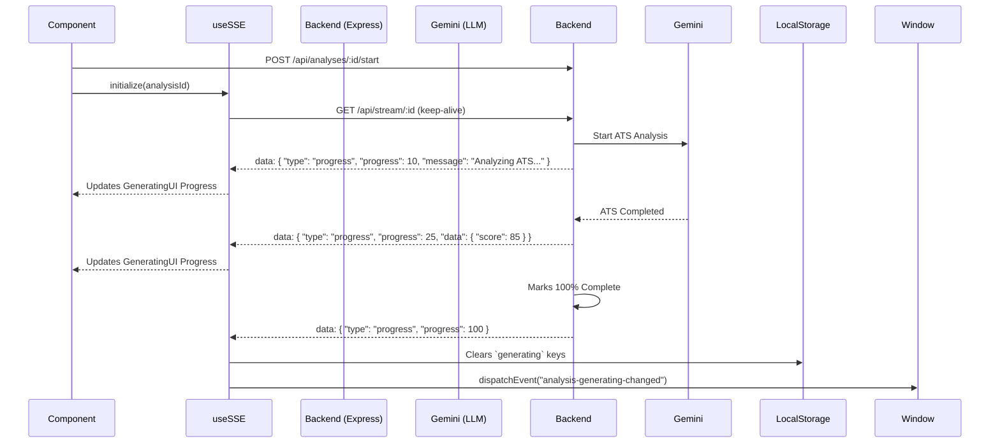
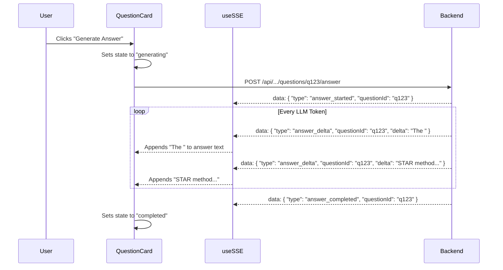

# Career Copilot Frontend Client - Architecture & Workflow Guide

Welcome to the frontend reference guide for the **Career Copilot Client**. This application is built with **Next.js (App Router)** and serves as the interactive user interface for the AI-driven career and resume analysis platform.

It is designed to handle complex, asynchronous AI generative workflows, offering real-time progress updates via Server-Sent Events (SSE), modular state management, and performant data fetching via React Query.

---

## Table of Contents
1. [Tech Stack](#tech-stack)
2. [Frontend Architecture Diagram](#frontend-architecture-diagram)
3. [State Management & Modularity](#state-management--modularity)
4. [SSE (Server-Sent Events) Flow & Handling](#sse-server-sent-events-flow--handling)
5. [Core Analysis Workflow](#core-analysis-workflow)
6. [Interview Questions & Answer Streaming](#interview-questions--answer-streaming)
7. [Roadmap Generation Workflow](#roadmap-generation-workflow)
8. [Local Development & Setup](#local-development--setup)

---

## Tech Stack

*   **Framework**: Next.js 16 (App Router)
*   **State Management**: Zustand (Auth), LocalStorage + Window Events (Analysis Modularity)
*   **Data Fetching**: TanStack React Query (`@tanstack/react-query`)
*   **API Protocol**: GraphQL (`graphql-request`) & REST (for SSE)
*   **Styling**: Tailwind CSS v4 + PostCSS
*   **Authentication**: Google OAuth (`@react-oauth/google`)

---

## Frontend Architecture Diagram

The frontend relies on a decoupled architecture where React Query handles data fetching from the GraphQL/REST backend, while `useSSE` manages a one-way persistent stream from the server for real-time progress updates.

```mermaid
graph TD
    Client[Next.js Client]
    Zustand[(Zustand Auth Store)]
    LStore[(Browser LocalStorage)]
    
    subgraph UI Components
        Dashboard[Dashboard]
        NewAnalysis[New Analysis Form]
        subgraph AnalysisDetail[Analysis Detail View]
            Tabs[Navigation Tabs]
            ATab[ATS / Optimizer]
            ITab[Interview Tab]
            RTab[Roadmap Tab]
            GenUI[Generating UI Overlay]
        end
    end

    subgraph Hooks Layer
        useAuth[useAuth]
        useQuery[TanStack React Query]
        useSSE[useSSE Hook]
    end

    subgraph Backend APIs
        GraphQL[GraphQL Endpoint]
        REST[REST / SSE Endpoints]
    end

    Client --> UI Components
    Zustand <--> useAuth
    Dashboard & NewAnalysis & AnalysisDetail <--> useQuery
    AnalysisDetail <--> useSSE
    
    useQuery <-->|Queries & Mutations| GraphQL
    useQuery <-->|Trigger Generation| REST
    REST -->|Stream Progress & Answers| useSSE
    
    useSSE -->|Persists Progress| LStore
    AnalysisDetail -->|Reads Progress| LStore
    useSSE -.->|Dispatches Window Events| Tabs
```

---

## State Management & Modularity

A critical architectural challenge in this application is managing the state of multiple, long-running asynchronous AI generations **without global state contamination**. If a user is generating an analysis for Job A, navigating to Job B must not show Job A's loading state.

### The "Per-Analysis" Persistence Pattern
To achieve strict modularity, we avoid using a global `isGenerating` flag in Zustand. Instead, the application ties generative state strictly to the specific `analysisId` using the browser's `localStorage` and custom DOM `Window` events.

1. **Persisting the Start Time**:
   When a generation begins, we store the start timestamp. This ensures that if the user unmounts the tab (or switches away and comes back), the `GeneratingUI` can recalculate exactly how much time has elapsed instead of resetting the progress bar to 0%.
   
   *Example snippet from `InterviewTab.tsx`:*
   ```tsx
   // Start generation
   localStorage.setItem(`interview-generating-${analysisId}`, "true");
   localStorage.setItem(`interview-start-${analysisId}`, Date.now().toString());
   
   // Trigger React state
   setIsGenerating(true);
   ```

2. **Cross-Component Reactivity via Window Events**:
   When the `useSSE` hook detects that the server has completed the generation (or if the generation completes while the tab is open), it clears the `localStorage` and dispatches a custom event. This allows isolated components (like the Tab navigation bar) to know when to remove their loading spinners.
   
   *Example snippet from `useSSE.ts`:*
   ```typescript
   if (progress === 100) {
     localStorage.removeItem(`analysis-generating-${analysisId}`);
     // Dispatch custom event to notify all components watching this specific analysis
     window.dispatchEvent(
       new CustomEvent("analysis-generating-changed", { detail: { analysisId } })
     );
   }
   ```

---

## SSE (Server-Sent Events) Flow & Handling

The `useSSE` hook establishes a persistent HTTP connection to receive unidirectional updates from the server. This is essential because standard HTTP requests would timeout during 60-90 second LLM processing phases.

### SSE Sequence Flow


### Technical Parsing of SSE Messages
The `useSSE` hook reads the stream chunk-by-chunk. Because TCP streams can fragment JSON payloads, it aggressively splits by `\n\n` (the SSE standard delimiter) and parses the `data: ` prefix.

```typescript
// Inside useSSE.ts chunk reader
const lines = chunk.split('\n\n');
for (const line of lines) {
  if (line.startsWith('data: ')) {
    const data = JSON.parse(line.replace('data: ', ''));
    
    if (data.type === 'progress') {
       // Updates global progress state for the UI
       setProgress(data.progress);
       setMessage(data.message);
    } 
    else if (data.type === 'answer_delta') {
       // Specific handling for typewriter streaming text
       handleAnswerDelta(data);
    }
  }
}
```

---

## Core Analysis Workflow

The complete analysis represents the initial pipeline: **ATS -> Skill Gap -> Resume Optimizer -> Cover Letter**.

1. **Initialization**: The user submits a Resume and Job Description. React Query sends a `POST /api/analyses` request, receiving a `pending` analysis ID.
2. **Mounting the UI**: The router navigates to `/analyses/[id]`. The `AnalysisTabs` and `ATSTab` (default) are rendered.
3. **Connecting Stream & Triggering Pipeline**: 
   The component sets the `localStorage` key (`analysis-generating-[id]`) and triggers `POST /api/analyses/[id]/start`.
4. **Rendering the Overlay**: While `localStorage.getItem('analysis-generating-[id]')` is true, the `GeneratingUI` component overlays the screen.
5. **Completion**: When the SSE stream hits `100%`, `useSSE` clears the keys. React Query's `useAnalysis` hook invalidates its cache, automatically fetching the newly generated GraphQL data, and the `GeneratingUI` unmounts, revealing the populated tabs.

---

## Interview Questions & Answer Streaming

The Interview tab takes modularity a step further by supporting **on-demand streaming** of answers for specific questions.

### Question Generation Flow
When the user clicks "Generate Questions":
1. Sets `interview-generating-[id]` in `localStorage`.
2. Calls `POST /api/analyses/[id]/interview`.
3. The `GeneratingUI` mounts over the Interview tab *only*. (The user can still view the ATS tab because it is decoupled).
4. Once completed via SSE (or polling fallback), the questions render.

### Answer Streaming (Typewriter Effect)
Generating answers for individual questions leverages the `answer_delta` event type in the SSE stream to create a real-time typewriter effect.



The `useSSE` hook exposes an `answers` state object that maps `questionId -> string`. The `QuestionCard` component observes this specific key and actively renders the accumulating string via `react-markdown`.

---

## Roadmap Generation Workflow

The Roadmap generation creates a localized plan containing Milestones, Steps, Estimated Hours, and heavily enriched Resource queries based on the candidate's specific Skill Gaps.

1. **Trigger**: Handled identically to the Interview workflow, isolating its state using `roadmap-generating-[id]`.
2. **Skeleton Fallback**: To prevent UI flickering when transitioning from "Generate" CTA to actual data, the `RoadmapTab` uses React Query's `isFetching` state. 
   ```tsx
   // RoadmapTab.tsx
   const { data, isLoading, isFetching } = useAnalysisRoadmap(analysisId);
   const isGenerating = localStorage.getItem(`roadmap-generating-${analysisId}`);
   
   // Prevents layout shift between CTA disappearing and data painting
   if ((isLoading || isFetching) && !data?.roadmap?.overview && !isGenerating) {
     return <TabContentSkeleton />;
   }
   ```
3. **Rendering**: Renders an interactive milestone tracker where users can visualize their learning path step-by-step.

---

## Local Development & Setup

### 1. Environment Variables
Create a `.env.local` file in the root directory:

```ini
# Core Next.js API configuration
NEXT_PUBLIC_API_URL=http://localhost:5000/api
NEXT_PUBLIC_GRAPHQL_URL=http://localhost:5000/graphql

# Authentication
NEXT_PUBLIC_GOOGLE_CLIENT_ID=your_google_client_id.apps.googleusercontent.com
```

### 2. Installation
```bash
npm install
```

### 3. Run Development Server
```bash
npm run dev
```

Open [http://localhost:3000](http://localhost:3000) with your browser to see the result.
